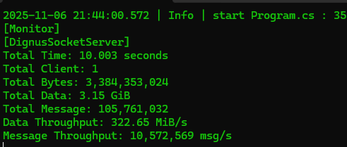
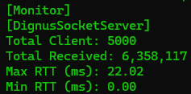
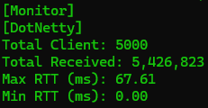
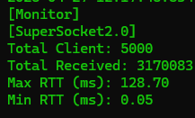
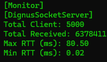
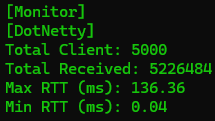
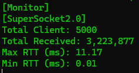

# 📈 DignusSocketServer 

## 🔥 Performance Benchmark

- Server address: 127.0.0.1
- Server port: 5000
- Working clients: 1
- Working messages: 1000
- Message size: 32
- Seconds to benchmarking: 10
- Client Threads: 1

[Monitor]
- Total Time: 10.003 seconds
- Total Client: 1
- Total Bytes: 3,384,353,024
- Total Data: 3.15 GiB
- Total Message: 105,761,032
- Data Throughput: 322.65 MiB/s
- Message Throughput: 10,572,569 msg/s

---

---
## Installation

https://www.nuget.org/packages/Dignus.Sockets

---

고성능 C# 비동기 소켓 서버 프레임워크입니다.
세션 풀링, 프레이밍 처리, 직렬화/역직렬화 구조 등을 통해 수십만 동시 접속과 수백만 메시지 처리 성능을 지원합니다.
가볍고 확장 가능하도록 설계되어 있습니다.

---

# 서버별 성능 비교 (2024-04-27)

## 🧪 테스트 조건

- 클라이언트가 서버에 접속합니다.
- 접속 이후, 각 클라이언트는 **30초 동안** 지속적으로 Echo 요청을 보냅니다.
- 서버는 Echo 요청을 수신 후, **간단한 비즈니스 로직(Json 역직렬화/직렬화)을 처리한 뒤** 응답합니다.
- 30초가 지나면 클라이언트는 연결을 종료하거나 패킷 전송을 멈춥니다.
- 측정 항목: 총 수신 패킷 수, 최대/최소 왕복 지연시간.

---

## 🚀 추가 참고사항 (초기 테스트 vs 웜업 후 테스트)

- 최초 테스트는 서버 부팅 직후 바로 진행되었으며, 최적화 전 상태였습니다.
- 웜업 후 테스트는 서버를 재시작하지 않고 클라이언트만 재실행하여 진행되었습니다.

---

# 🧊 서버 초기 상태 테스트 결과 (Cold Start)

| 항목 | DignusSocketServer | DotNetty | SuperSocket 2.0 |
|:---|:---|:---|:---|
| Total Clients | 5000 | 5000 | 5000 |
| Total Received | 6,735,665 | 5,426,823 | 3,191,922 |
| Max RTT (ms) | 63.75 | 67.61 | 11.72 |
| Min RTT (ms) | 0.00 | 0.00 | 0.00 |

---

# 🔥 웜업 이후 테스트 결과 (Warm-up)

| 항목 | DignusSocketServer | DotNetty | SuperSocket 2.0 |
|:---|:---|:---|:---|
| Total Clients | 5000 | 5000 | 5000 |
| Total Received | 6,921,356 | 5,836,706 | 3,223,877 |
| Max RTT (ms) | 23.55 | 77.93 | 11.17 |
| Min RTT (ms) | 0.00 | 0.00 | 0.01 |

---

# 📊 초기 vs 웜업 비교

| 항목 | DignusSocketServer (초기) | DignusSocketServer (웜업 후) | DotNetty (초기) | DotNetty (웜업 후) | SuperSocket 2.0 (초기) | SuperSocket 2.0 (웜업 후) |
|:---|:---|:---|:---|:---|:---|:---|
| Total Clients | 5000 | 5000 | 5000 | 5000 | 5000 | 5000 |
| Total Received | 6,735,665 | 6,921,356 | 5,426,823 | 5,836,706 | 3,191,922 | 3,223,877 |
| Max RTT (ms) | 63.75 | 23.55 | 67.61 | 77.93 | 11.72 | 11.17 |
| Min RTT (ms) | 0.00 | 0.00 | 0.00 | 0.00 | 0.00 | 0.01 |

---

# 🖼️ 테스트 결과 캡처 (초기)

| DignusSocketServer | DotNetty | SuperSocket 2.0 |
|:---:|:---:|:---:|
|  |  |  |

---

# 🖼️ 테스트 결과 캡처 (웜업 후)

| DignusSocketServer (Warm-up) | DotNetty (Warm-up) | SuperSocket 2.0 (Warm-up) |
|:---:|:---:|:---:|
|  |  |  |

---

## 📅 테스트 일자
- 2024-04-27

# 📈 DignusSocketServer
A high-performance asynchronous socket server framework built with C#.
Supports hundreds of thousands of concurrent connections and millions of messages through:

Reusable SocketAsyncEventArgs

Session pooling

Framing logic

Custom serialization/deserialization architecture

It is designed to be lightweight, efficient, and easily extensible.

---

# Server Performance Comparison (2024-04-27)

## 🧪 Test Conditions

- Clients connect to the server.
- After connection, each client continuously sends Echo requests for **30 seconds**.
- Upon receiving an Echo request, the server **processes simple business logic (Json deserialization/serialization)** and then responds.
- After 30 seconds, clients disconnect or stop sending packets.
- Measurement items: Total packets received, Max RTT, Min RTT.

---

## 🚀 Additional Notes (Cold Start vs Warm-up Test)

- The initial test was conducted immediately after the server boot, before full optimization.
- The warm-up test was conducted by re-running only the clients without restarting the server.

---

# 🧊 Initial Server State Test Results (Cold Start)

| Item | DignusSocketServer | DotNetty | SuperSocket 2.0 |
|:---|:---|:---|:---|
| Total Clients | 5000 | 5000 | 5000 |
| Total Received | 6,735,665 | 5,426,823 | 3,191,922 |
| Max RTT (ms) | 63.75 | 67.61 | 11.72 |
| Min RTT (ms) | 0.00 | 0.00 | 0.00 |

---

# 🔥 Post-Warm-up Test Results

| Item | DignusSocketServer | DotNetty | SuperSocket 2.0 |
|:---|:---|:---|:---|
| Total Clients | 5000 | 5000 | 5000 |
| Total Received | 6,921,356 | 5,836,706 | 3,223,877 |
| Max RTT (ms) | 23.55 | 77.93 | 11.17 |
| Min RTT (ms) | 0.00 | 0.00 | 0.01 |

---

# 📊 Cold Start vs Warm-up Comparison

| Item | DignusSocketServer (Cold) | DignusSocketServer (Warm-up) | DotNetty (Cold) | DotNetty (Warm-up) | SuperSocket 2.0 (Cold) | SuperSocket 2.0 (Warm-up) |
|:---|:---|:---|:---|:---|:---|:---|
| Total Clients | 5000 | 5000 | 5000 | 5000 | 5000 | 5000 |
| Total Received | 6,735,665 | 6,921,356 | 5,426,823 | 5,836,706 | 3,191,922 | 3,223,877 |
| Max RTT (ms) | 63.75 | 23.55 | 67.61 | 77.93 | 11.72 | 11.17 |
| Min RTT (ms) | 0.00 | 0.00 | 0.00 | 0.00 | 0.00 | 0.01 |

# 🖼️ Test Result Captures (Cold Start)

| DignusSocketServer | DotNetty | SuperSocket 2.0 |
|:---:|:---:|:---:|
|  |  |  |

---

# 🖼️ Test Result Captures (Warm-up)

| DignusSocketServer (Warm-up) | DotNetty (Warm-up) | SuperSocket 2.0 (Warm-up) |
|:---:|:---:|:---:|
|  |  |  |
